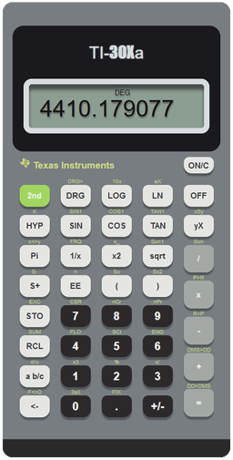

TI-30Xa calculator made in Elm back in 2019.

# How to Run

1. [Install Elm](https://guide.elm-lang.org/install/elm.html)
2. Call `elm make src/Main.elm` in the project root folder.
3. This should create `index.html`.
4. Run the `index.html` and press `ON\C` to turn on the calculator.
